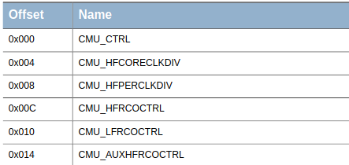
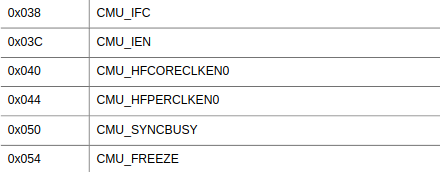

# Mikrokontrollere fra bunnen opp

Dette er en rask intro til mikrokontrollere uten all støyen som
utviklingsstudioer introduserer. Noe her er spesifikt til ARM, fordi det
er det vi bruker i DMPRO - men det meste gjelder for andre arkitekturer også.

## TLDR

Installer OpenOCD og arm-none-eabi-gcc. Fra denne mappen, kall:

```
cmake -B build -S .
cd build
make
make flash
```

Forhåpentligvis vil LEDene på kortet bytte på å blinke.

## Hva må til for å kjøre kode på en mikrokontroller?

Prosessen for å få kode til å kjøre på en mikrokontroller er stort sett:
1. Kryss-kompiler C/C++ til et instruksjonssett som mikrokontrollerens
   arkitektur forstår. I vårt tilfelle er det `T32`
   (Tidligere kalt `Thumb`/`Thumb2`).
2. Bruk et lenkerscript til å plassere kode på riktig sted i Flash, og
   til å fortelle lenkeren hvor mye RAM vi har, og hvor den starter.
3. Det første som kjører på mikrokontrolleren (til og med før `main`) er en
   `Reset_Handler`, som har ansvar for å kopiere initialiserte variabler fra
   Flash til RAM, nulle ut ikke-initialiserte variabler, konfigurere
   interrupts, etc.

På ARM er det slik at CPUen tar `initial Main Stack Pointer` fra adresse
`0x0000_0000`, og adressen til `Reset_Handler` fra adresse `0x0000_0004`.
Disse adressene, sammen med adresser til andre interrupt-handlere er det ARM
kaller en "vektortabell".

Vi skriver gjerne vektortabellen i assembly, fordi det gjør det enkelt å
garantere hvor i minne ting puttes.

I dette eksempelrepoet kan dere se en veldig minimalistisk vektortabell
under [vector_table.S](system/vector_table.S).
Denne tabellen er litt hasardiøs, fordi vi vil få udefinert oppførsel dersom
en interrupt vi ikke har tatt høyde for utløses. Uansett kan den lett
utvides for å støtte både ARM-definerte interrupts (slik som NMI, HardFault,
SysTick, etc.), og vendor-spesifikke interrupts - som er definert i
tabell 4.1 i databladet til [EFM32en](https://www.silabs.com/documents/public/reference-manuals/EFM32GG-RM.pdf).

Den vedlagte vektortabellen kompilerer til en seksjon kalt "_vector_table".
Ofte vil dere se at produsenter bruker ledende punktum, som i ".vector_table",
som om dette streng tatt er reserverte navn i følge ELF-standarden.

Vektortabellen vår ser slik ut:
```asm
_vector_table:
    .long _stack_top
    .long Reset_Handler
```

Den forteller oss at `_stack_top` ligger helt i starten, altså med offset
`0x00` fra der `_vector_table` starter. Etter det har vi adressen til
`Reset_Handler`, som kommer 4 byte senere, med offset `0x04`.

Både `_stack_top` og `Reset_Handler` er definert andre steder - nemlig i
lenkerscriptet vårt, og i filen [reset_handler.c](system/reset_handler.c).

## Lenkerscriptet

La oss ta en titt på [lenkerscriptet](system/linker.ld) først, som ser slik ut:
```ld
ENTRY(Reset_Handler)

MEMORY {
	flash (rx) : ORIGIN = 0x00000000, LENGTH = 1024K
	ram (rwx) : ORIGIN = 0x20000000, LENGTH = 128K
}

_stack_top = ORIGIN(ram) + LENGTH(ram);

SECTIONS {
	.text : {
		KEEP(*(VectorTable))
		*(.text .text.*)
		*(.rodata .rodata.*)
		_etext = .;
	} > flash

	.data : {
		_sdata = .;
		*(.data .data.*)
		_edata = .;
	} > ram AT > flash

	.bss (NOLOAD) : {
		_sbss = .;
		*(.bss .bss.*)
		*(COMMON)
		_ebss = .;
	} > ram
}
```

Syntaksen her er nok litt ukjent, og dokumentasjonen som finnes på dette er
litt dårlig, men i korte trekk gjør vi dette:

1. Først sier vi at koden vår starter på `Reset_Handler`. Vi må fortelle
   lenkeren dette, slik at den ikke markerer all kode som ubrukt, og
   utelater å lenke den inn.
2. Deretter forteller vi hvor Flash og RAM starter, og hvor store de er.
   Dette er informasjon vi finner i seksjon 5.2 i [EFM32-databladet](https://www.silabs.com/documents/public/reference-manuals/EFM32GG-RM.pdf).
   I tillegg forteller vi at vi kan lese og kjøre kode fra flash `(rx)`,
   og lese, skrive, og kjøre kode fra RAM `(rwx)`.
3. Etter dette definerer vi lenkervariabelen `_stack_top`, som vi så tidligere
   i [vektortabellen](system/vector_table.S) vår. Grunnen til at setter denne
   til den høyeste adressen i RAM, er at ARMv7-dokumentasjonen forteller oss at
   hver gang en ny stackframe lages, "vokser" stacken nedover - altså ned
   mot mindre adresser.
4. Etter dette forteller vi lenkeren hvilke seksjoner vi skal ta vare på fra
   kompilatoren, og hvor disse seksjonene skal plasseres. Disse er forklart
   under:

### SECTIONS
* `.text` Dette er seksjonen for kjørbar kode. Det første vi plasserer her
  er vektortabellen. Etter det tar vi alle seksjoner som kompilatoren lagde,
  som starter med navnet `.text` eller `.rodata` (read-only-data).
  Dette putter vi inn i Flash (`> flash`).
* `.data` Dette er seksjonen som inneholder all initialisert data fra koden
  vår. Denne er litt spesiell, fordi vi ønsker at dataen skal være tilgjengelig
  i RAM i kjøretid, slik at vi kan lese den effektivt og endre den om ønskelig.
  Allikevel må vi lagre de initialiserte verdiene et sted hvor de ikke
  forsvinner - som da blir Flash i vårt tilfelle. Dette uttrykkes med
  `> ram AT > flash`, som vi kan lese som "finnes i RAM, men er lagret i
  Flash".
* `.bss` Block Starting Symbol er all data som ikke er initialisert. Dette er
  data som `Reset_Handler` er ansvarlig for å nulle ut før programmet vårt
  starter. Denne skal finnes i RAM (`> ram`), men fordi alt skal være null
  i det vi går inn i kjøretid, så trenger vi ikke lagre noe i Flash, som vi
  måtte for `.data`.

I tillegg til disse seksjonene, oppretter vi en liten håndfull lenkervariabler
som `Reset_Handler` kan bruke for å kopiere ting til riktig sted.
Disse variablene er:

* `_etext` Sluttadressen til `.text`-seksjonen.
* `_sdata/_edata` Start- og sluttadressen til `.data`.
* `_sbss/_ebss` Start- og sluttadressen til `.bss`.

## Reset_Handler

`Reset_Handler` er altså den første funksjonen som kjører på mikrokontrolleren,
før `main` starter. Dere kan se den i [reset_handler.c](system/reset_handler.c):

```c
#include <stdint.h>
#include <stdnoreturn.h>

int main();

extern uint8_t _etext;
extern uint8_t _sdata;
extern uint8_t _edata;
extern uint8_t _sbss;
extern uint8_t _ebss;

/* Memory System Controller */
#define MSC_CMD_ADDRESS 0x400C0040

noreturn void Reset_Handler() {
    /* Copy data from Flash to RAM */
    uint8_t * p_source = &_etext;
    for (uint8_t * p_dest = &_sdata; p_dest < &_edata; p_dest++, p_source++) {
        *p_dest = *p_source;
    }

    /* Zero BSS */
    for (uint8_t * p_bss = &_sbss; p_bss < &_ebss; p_bss++) {
        *p_bss = 0;
    }

    /* Invalidate instruction cache */
    *((volatile uint32_t *)MSC_CMD_ADDRESS) = 1;

    main();

    while (1) {}
}
```

Det meste i den filen er bare vanlig C-kode, men det er et par ting som kan
være verdt å merke seg:

### #include <stdnoreturn.h>

`stdnoreturn.h` lar oss dekorere `Reset_Handler` med `noreturn`, som betyr
at vi forteller kompilatoren at funksjonen ikke under noen normal
omstendighet skal returnere. Når vi har startet `main`, skal vi aldri
stoppe programmet vårt.

### extern uint_t _etext; etc.

Kodeordet `extern` forteller kompilatoren at dette symbolet finnes utenfor
kompileringsenheten vi holder på med. Ett eller annet sted, iallefall.
Dere vil kjenne igjen disse som lenkervariablene vi opprettet i lenkerscriptet.

En liten finurlighet ved lenkervariabler er at vi må bruke dem ved referanser,
som i `uint8_t * p_dest = &_sdata;`. Dette er en del av C-standarden som vi
bare må leve med.

### #define MSC_CMD_ADDRESS 0x400C0040

Dette er den første EFM32-spesifikke koden vi ser.
MSC står for "Memory System Controller", og har styring på instruksjons-
cache og data-cache. Fra tabell 5.1 [EFM32-databladet](https://www.silabs.com/documents/public/reference-manuals/EFM32GG-RM.pdf) finner vi baseadressen
til MSCen, og fra seksjon 7.4 i det samme databladet ser vi at registeret
`MSC_CMD` har en offset på `0x40`.
Videre ser vi fra seksjon 7.5.13 at vi kan skrive `1` til dette registeret
for å invalidere instruksjons-cachen. Dette gjør vi med en litt funky syntaks:

```c
*((volatile uint32_t *)MSC_CMD_ADDRESS) = 1;
```

Les dette som "typecast `MSC_CMD_ADDRESS` til en 32-bits peker, som er
volatile, og skriv `1` til den adressen". Grunnen til at vi spesifiserer
`volatile` er at dette forteller kompilatoren at data pekt til av slike
pekere kan endre seg i bakgrunnen, uten at CPUen har gjort noe. Vi putter
alltid `volatile` på ting som er minnemappet - som vi kommer til nå.

## Minnemappet IO

De fleste moderne mikrokontrollere benytter seg av minnemappet IO.
Det betyr at perifere enheter legges inn i samme minnerom som alt annet,
og at vi snakker med dem via minnebussen.

Det er flere måter å gjøre dette på i C, men den mest vanlige varianten
er å definere en struct som har samme minnefotavtrykk som en perifer enhet,
og så bruke en typecast for å få en peker til minneområdet okkupert av enheten
vi ønsker å snakke med.

Dette er enklest å se ved et eksempel. La oss derfor ta for oss EFM32en sin
CMU; Clock Management Unit.

### Finn startadressen til enheten

Startadressen til CMUen finner vi tabell 5.1 i databladet.
Her står det at CMUen finnes på adresse `0x400C_8000`.

### Finn registeroversikten til enheten

Deretter sjekker vi det spesifikke kapittelet til enheten vi er
interessert i. I vårt tilfelle er dette kapittel 11 - og spesifikt
seksjon 11.4.



Ta en titt på `offset`-verdiene i dette utsnittet. Vi ser at de øker med
4 for hvert register. 4 byte er det samme som 32 bit, som også gir mening,
fordi vi jobber med en 32 bit arkitektur. Vi kan altså minnemappe disse
registerene ved å legge ut sekvensielle `uint32_t` verdier i en C struct:

```c
typedef struct {
  uint32_t ctrl;
  uint32_t hfcoreclkdiv;
  uint32_t hfperclkdiv;
  uint32_t hfroctrl;
  uint32_t ...
} Cmu;
```

Ofte finnes det "tomrom" i registeroversikten. Dette kan være registre som av
forskjellige årsaker ikke er dokumenterte - slik som hemmelige debugregistre -
eller det kan simpelthen være reserverte. Et eksempel på dette ser vi under:



Her ser vi at adressene gjør et lite hopp: `0x40` -> `0x44 (+4)` -> `0x50 (+12)`
-> `0x54 (+4)`. Med andre ord ser minnekartet slik ut:

* ...
* `0x40`: CMU_HFCORECLKEN0
* `0x44`: CMU_HFPERCLKEN0
* `0x48`: -
* `0x4C`: _
* `0x50`: CMU_SYNCBUSY
* `0x54`: CMU_FREEZE
* ...

Dette må vi være litt på pass med, og ta høyde for i koden vår:

```c
typedef struct {
  ...
  uint32_t hfcoreclken0;
  uint32_t hfperclken0;
  uint32_t reserved0[2]; /* Dette feltet */
  uint32_t syncbusy;
  uint32_t freeze;
  ...
} Cmu;
```

Dere kan se et helt eksempel av dette i [cmu.c](src/cmu.c).

## Aksesser registrene i den perifere enheten

Når vi har en korrekt minnemapping, bruker vi pekertypecasting for å lese fra-
og skrive til registrene vi ønsker:

```c
volatile Cmu * const cmu = (Cmu *)(0x400C8000);

cmu->hfperclken0 = (1 << 13);
```

### Sidenotat om pekertyper

Vi leser alltid pekere fra høyre til venstre.
```c
volatile Cmu * const cmu
```
Dette leser vi som "`cmu` er en `const`ant peker til en `Cmu`-type, som er
`volatile`".

Det at pekeren er `const` betyr at selve pekervariabelen ikke kan endre seg,
det vil si peke til noe annet enn det vi først setter den til.
Vi kan fortsatt endre det bakenforliggende minnet pekeren peker til.

En peker som ikke kan endre minnet den peker til, ser slik ut:

```c
volatile const Cmu * cmu
```

Dette leses som "`cmu` er en peker til en `Cmu`-type, som er både `const` og
`volatile`".
I et slikt tilfelle kan det fortsatt være viktig å bruke `volatile` dersom
vi snakker om et minnemappet område. `const` betyr bare at vi ikke kan endre
minneområdet via vår egen kode. `volatile` forteller kompilatoren at minnet
muligens fortsatt kan endre seg ved andre mekanismer - som ved at
mikrokontrolleren endrer de registerene i bakgrunnen.

## Byggesystemet

For å få alle disse komponentene til å snakke sammen, setter man gjerne opp
et byggesystem, slik at man slipper å kalle et utall sett med kommandoer selv.
Dette kan være så mangt, `GNU Make` er et godt og enkelt alternativ.
Her har vi imidlertid brukt `CMake`, som kan generere `Make`filer.

Når dere legger til headerfiler, så putter dere dem i mappen som heter
`include`. Og når dere legger til C-filer, putter dere dem i mappen som heter
`src`, i tillegg til at dere oppdaterer `src/CMakeLists.txt` med navnet
til den nye filen. Til slutt må man generere byggesystemet på nytt:

```
cmake -B build -S .
```

Om man kun endrer på kode, uten å legge til eller fjerne filer, trenger
man ikke lage hele byggesystemet på nytt:

```
cd build
make
(Eller: make debug)
(Eller: make flash)
```

## Flashing/Programmering

Det siste steget er å putte den ferdig kompilerte koden på chippen.
Vi bruker OpenOCD for dette.

Utviklingskortet støtter JLink, så vi kan starte en OpenOCD-server
ved å kalle

```
openocd -f "interface/jlink.cfg" -c "transport select swd" -f "target/efm32.cfg"
```

Denne serveren må kjøre for å kunne kalle `make flash` fra byggemappen.

Eventuelt, om man ikke ønsker debugging, kan man kalle
```
openocd -f "interface/jlink.cfg" -c "transport select swd" -f "target/efm32.cfg" -c "program main.elf verify reset"
```

### NB

En OpenOCD-server, som er nødvendig for å kunne debugge, kan ikke kjøre
samtidig som du kaller `make flash`. Om flashing ikke fungerer, er dette
en sannsynlig grunn.

## Andre ting å tenke på

Mikrokontrollerprogrammering er selve inkarnasjonen av "the devil is in
the details". Det er mye å tenke på, og lett å gjøre feil.
Bare ta det med ro, bit i puta når ting suger for hardt.

Databladet er din venn, og alt vi trenger står stort sett der.
Og spør om hjelp, vi har loket en god del med dette før, så det er ingen
grunn til å stuke alt for lenge. (Stuk litt da, det lærer man av)
